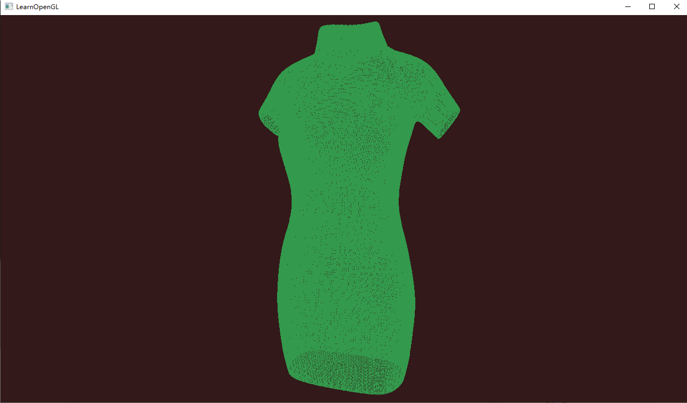

# A small tool for reading bcc file

A small tool for reading and plotting BCC cloth file provided by 

[Yuskel]: http://www.cemyuksel.com/research/yarnmodels/

(the sample codes provided by Yuskel have some problems..)

## Usage

1. create a VS project, add TestBCCReader.cpp and glad.c to the project
2. add include path
   * src
   * ThirdParty/cyCodeBase-master
   * ThirdParty/glfw-3.3.6.bin.WIN64\include
3. add library path
   * ThirdParty/glfw-3.3.6.bin.WIN64/lib-vc2019
4. copy shaders to project path
   * src/test.vs  and src/test.ps

## Screenshot

